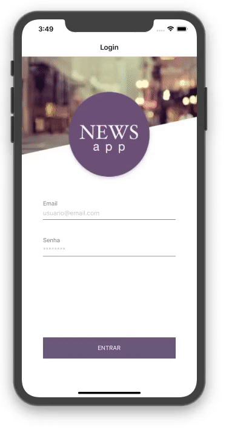

<div align="center">

# Mobile News App



</div>

<div align="center">

[](https://github.com/tuliocll)[](#)[](https://twitter.com/tuliocalil)

## Demo (ainda vou fazer deploy)

</div>

## 📖 Sobre

Aplicação desenvolvida para a gravação do vídeo para o Rocketseat Experts.

Projeto desenvolvido em React Native + Context Api.

### 📚 Principais Libs e recursos:

- ReactJs
- React Navigation
- Styled Components

## 🚀 Rodando o projeto

Clone o repositorio:

```bash
git clone https://github.com/tuliocll/newsapp-mobile.git
```

Instale as dependencias:

```bash
npm install
```

ou

```bash
yarn
```

Rode o servidor:

```bash
npm start
```

ou

```bash
yarn start
```

##### (Ios rode o npx pod install)

Rode o emulador

```bash
npx react-native run-ios
#ou
npx react-native run-android
```

## 🙅🏿‍♂️End
